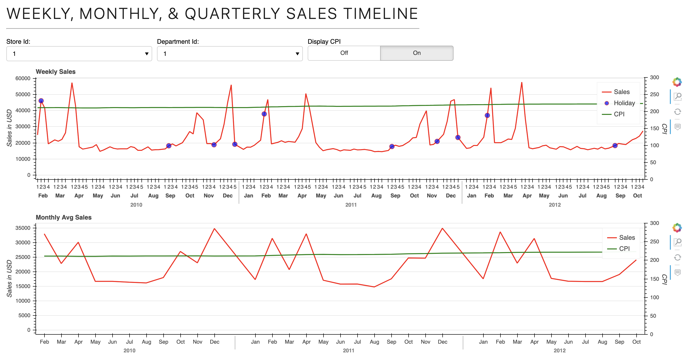
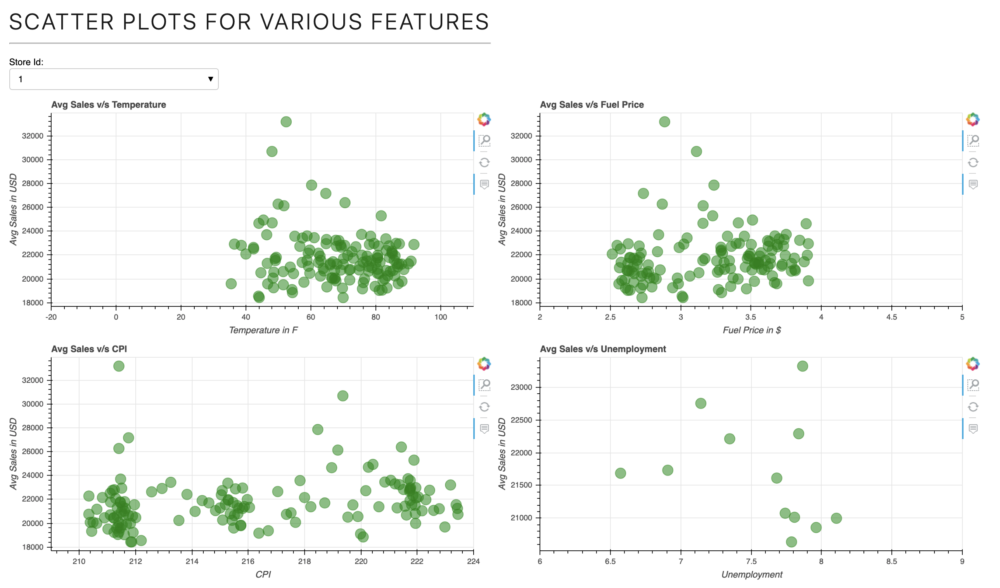
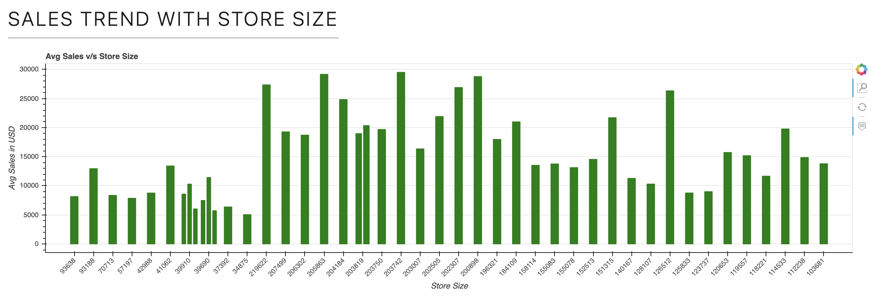

# Walmart Sales Data Visualization

## Web Application

Hosted on Heroku: https://walmart-sales-data-vis.herokuapp.com/myapp

## Screenshots
### Sales Timeline
Shows the weekly, monthly, and quarterly sales trend of average sales for each store and department.

### Scatter Plots
Shows the scatter plot to analyze the impact of time-dependent variables like temperature, fuel price, CPI, 
unemployment on average sales of each store.

### Trend with Store Size
Shows the bar chart of every store's size and average sales.

## Local Env

1. Clone the repository.
2. Change directory to the cloned repository.
3. Execute the following commands.

### Setup

**ONE TIME** setup to create a venv and install required dependencies. 

`source setup.sh`

### Running application
Once setup has been done, use this command to start the application. Note that you do **NOT** have to run setup again.

`bokeh serve --show myapp/`

## Author

* **[Dimple Singhania](https://github.com/chikorita5)**
